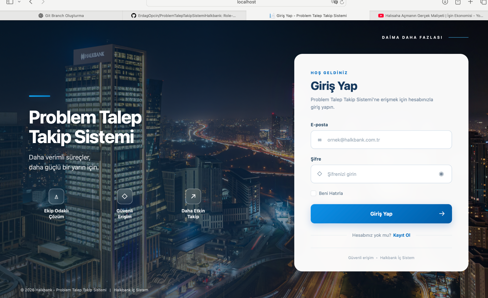
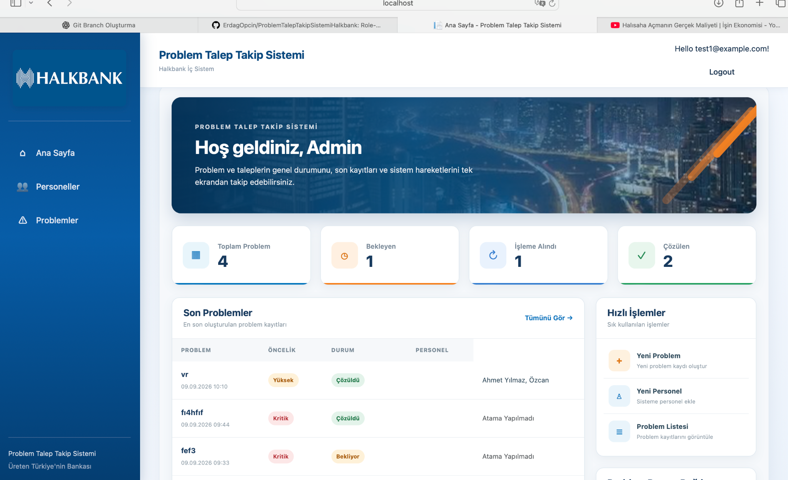
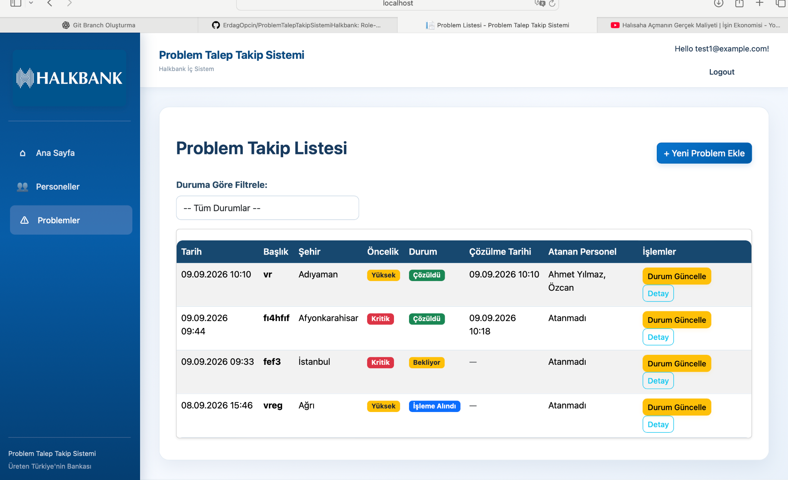
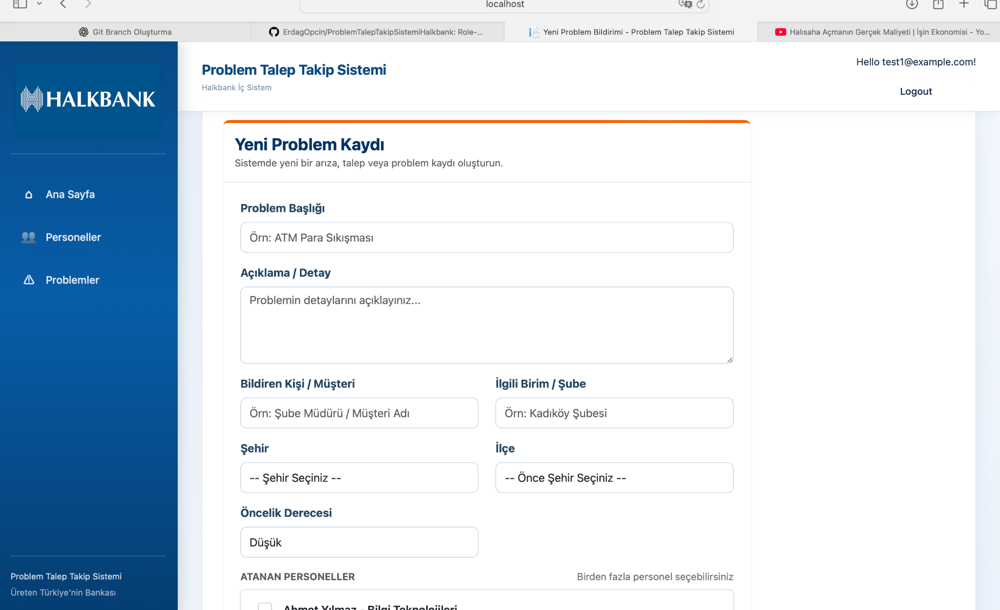

# Problem & Request Tracking System

A role-based internal **Problem & Request Tracking System** developed with ASP.NET Core Razor Pages, Entity Framework Core, Microsoft SQL Server and ASP.NET Core Identity.

The application provides a centralized platform for recording, assigning and tracking internal problems and requests. It includes role-based authorization, personnel management, multi-personnel assignment, status and priority tracking, dashboard analytics and external API integration.

> Developed as a collaborative software project during my internship experience in the banking technology domain.

---

## Application Preview

### Login



The application provides secure authentication through ASP.NET Core Identity. Users must authenticate before accessing protected application pages.

### Admin Dashboard



The dashboard provides a real-time overview of problem records, including total, pending, in-progress and resolved problems.

### Problem Tracking



Problems can be filtered and monitored according to their current status. Each record contains information such as priority, status, assigned personnel and resolution date.

### Create & Assign Problems



Administrators can create new problem records, select priority levels, choose city/district information and assign one or multiple personnel to a problem.

---

## Key Features

- Secure user authentication with **ASP.NET Core Identity**
- Role-based authorization with **Admin** and **Personnel** roles
- Global authentication requirement for protected application pages
- Personnel creation, editing, listing and management
- Problem and request creation and tracking
- Multi-personnel problem assignment
- Problem priority levels:
  - Low
  - Medium
  - High
  - Critical
- Problem status workflow:
  - Pending
  - In Progress
  - Resolved
- Automatic resolution date tracking
- Status-based problem filtering
- Personnel-specific assigned problem views
- City and district selection through an external REST API
- Dynamic dashboard statistics
- Password leak validation through an external API
- Responsive and customized user interface

---

## Role-Based Access Control

The system implements two primary authorization roles.

### Admin

Administrators can:

- Create and manage personnel
- Create problem records
- Assign problems to personnel
- Assign multiple personnel to the same problem
- Update problem status
- View all problem records
- Access administrative operations and dashboard information

### Personnel

Personnel users can:

- Log in securely
- View problems assigned to them
- Access permitted problem information

Administrative operations such as personnel creation and problem status updates are restricted through server-side authorization.

---

## Security

Authentication and authorization are implemented using **ASP.NET Core Identity**.

The application includes:

- Secure Identity-based password storage
- Unique user email configuration
- Role-based authorization
- Protected application routes
- Current-password verification for password changes
- Password leak detection using the **Have I Been Pwned Pwned Passwords API**

For password leak validation, the application uses a **k-anonymity approach**, meaning the complete password hash is not transmitted to the external service.

---

## External API Integration

The project uses `HttpClient` to communicate with external REST APIs.

### Türkiye City & District API

City and district information is dynamically retrieved and used while creating problem records.

Selecting a city dynamically updates the available districts.

### Password Leak API

Password security is enhanced through integration with the Have I Been Pwned password database.

The application checks whether a password has appeared in known data breaches without transmitting the complete password hash.

---

## Database Design

The application uses **Entity Framework Core** with Microsoft SQL Server.

Main entities include:

### Problem

A problem record contains information such as:

- Title
- Description
- Reporter
- Department / Unit
- City
- District
- Priority
- Status
- Creation Date
- Resolution Date
- Assigned Personnel

### Personnel

Personnel records contain:

- Full Name
- Department / Unit
- Identity User relationship
- Assigned Problems

### Problem-Personnel Relationship

The project supports assigning **multiple personnel to a single problem** through a relational structure managed with Entity Framework Core.

Database schema changes are managed through **EF Core Migrations**.

---

## Tech Stack

| Technology | Purpose |
|---|---|
| C# | Backend programming language |
| ASP.NET Core | Web application framework |
| Razor Pages | Server-side UI architecture |
| Entity Framework Core | ORM and database access |
| Microsoft SQL Server | Relational database |
| ASP.NET Core Identity | Authentication and user management |
| REST APIs | External service integration |
| HttpClient | API communication |
| HTML / CSS | User interface |
| Bootstrap | Responsive UI components |
| Git | Version control |
| GitHub | Collaboration and source control |

---

## Architecture

The project follows the standard ASP.NET Core Razor Pages structure.

```text
ProblemTalepTakipSistemiHalkbank/
│
├── Areas/
│   └── Identity/
│
├── Data/
│   └── ApplicationDbContext.cs
│
├── Migrations/
│
├── Models/
│
├── Pages/
│   ├── Personeller/
│   ├── Problemler/
│   └── Shared/
│
├── Services/
│
├── wwwroot/
│   ├── css/
│   └── images/
│
├── docs/
│   └── screenshots/
│
└── Program.cs
```

---

## Getting Started

### Prerequisites

To run the project locally, you need:

- .NET SDK
- Microsoft SQL Server
- Git

### Clone the Repository

```bash
git clone https://github.com/ErdagOpcin/ProblemTalepTakipSistemiHalkbank.git
```

Navigate to the project directory:

```bash
cd ProblemTalepTakipSistemiHalkbank
```

### Configure the Database

Configure the `DefaultConnection` connection string using .NET User Secrets or your preferred secure configuration method.

Example:

```bash
dotnet user-secrets set "ConnectionStrings:DefaultConnection" "YOUR_CONNECTION_STRING"
```

> Do not commit database credentials or sensitive configuration values to source control.

### Apply Database Migrations

```bash
dotnet ef database update
```

### Run the Application

```bash
dotnet run
```

Open the local address displayed in the terminal.

---

## Development Highlights

This project provided hands-on experience with:

- Designing a relational database-backed application
- ASP.NET Core authentication and authorization
- Role-based access control
- Entity Framework Core relationships
- Many-to-many data modeling
- Database migrations
- REST API consumption
- Secure password validation
- Razor Pages development
- Git branching and collaborative development
- Building a complete application workflow from authentication to data management

---

## Contributors

Developed collaboratively as part of a software development project.

**Erdağ Öpçin**

Primary contributions include authentication and authorization infrastructure, ASP.NET Core Identity integration, role management, security features, application integration and UI development.

---

## Disclaimer

This project was developed for educational and internship-related purposes.

It is **not an official Halkbank production system** and does not contain real customer or production banking data.